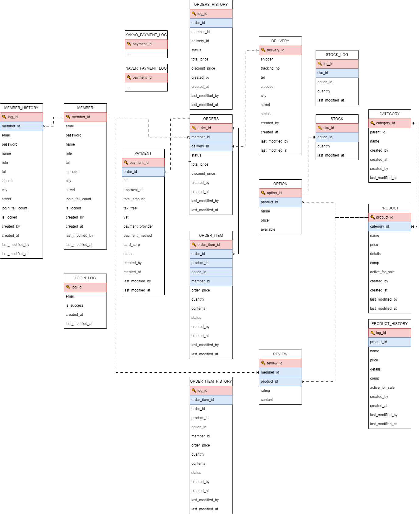

# Mungstore
## [>> 日本語](#Ja)

## 프로젝트 기본 정보
- **개발 기간** : `2024.05.04` - `2024.06.21`
- **깃허브 링크** : https://github.com/juljasong/mungstore
- **목표** : 반려동물 커머스 서버를 구축한다.

### 개발 환경
| 분류            | 설명                                                           |
|---------------|--------------------------------------------------------------|
| 운영체제          | Windows 10                                                   |
| 버전 관리 시스템     | Git, Github                                                  |
| 개발 도구         | IntelliJ IDEA                                                |
| 개발 언어 및 프레임워크 | Java 17 <br/> Spring Framework 6.1.6 </br> Spring Boot 3.2.5 |
| 데이터베이스 | MySQL 8.4.0 <br/> Redis 7.2.4                                |

---

## 사용 기술 
### 메인 기술


### 데이터베이스


### etc


---
## 서비스 기본 설명
### ERD


### Gradle Multi-Module 구조
```
.
├── api
├── common
├── consumer
├── kafka
├── member
├── order
├── payment
├── product
├── stock
```

### 모듈 설명
- api
  - application 영역
  - 외부에서의 진입점 (Controller)
- common
  - 전체 모듈에서 공통적으로 사용할 domain, exception, request, response, utils 등을 모아놓은 모듈
- consumer
  - kafka 메세지를 가져오는 kafka consumer
- kafka
  - kafka 메세지를 생성하는 kafka producer
- member
  - 인증 (jwt), 회원, 장바구니 기능 담당
- order
  - 주문(주문, 취소, 조회) 기능 담당
- payment
  - 결제(카카오 결제, 취소) 기능 담당
- product
  - 상품(상품 등록, 수정, 삭제, 조회), 옵션, 카테고리 기능 담당
- stock
  - 재고(확인) 기능 담당

---
## 사전 준비
- IntelliJ IDEA
- jdk 17

## Tools
- Docker Client 설치
- MySQL 설정
  - id : root
  - password : root
  - db명 : mungstore
- 프로젝트 폴더에서 이하의 명령어 수행
```shell
$ docker-compose up -d  # 1
$ cd docker             # 2
$ sh docker-build.sh    # 3
$ docker-compose up -d  # 4
```
_! build 과정에서 flyway에 문제가 생기는 경우, mungstore DB의 table 모두 삭제 후 3번 부터 다시 진행 해 주세요._

_! mungstore-kafka가 제대로 실행되지 않는 않는 경우, Docker Client에서 mungstore-kafka만 재실행 해 주세요._

---
## API 문서
### Swagger
- http://localhost:8080/swagger-ui/index.html

## 기능
### member
- [x] 회원가입
  - [x] 비밀번호 유효성 체크
- [x] 로그인
  - [x] 비밀번호 오류 5회 시 패스워드 초기화
  - [x] 로그인 이력 저장
  - [x] 로그인 이후 인증 필요한 요청 토큰 체크
  - [x] access token 만료 시 refresh token으로 access token 재발행
- [x] 로그아웃
- [x] 비밀번호 재설정
  - [x] 비밀번호 재설정 url 생성 후 이메일 송신
  - [x] 비밀번호 재설정
- [x] 회원 조회
  - [x] 상세
  - [x] 리스트(검색)
- [x] 회원 정보 수정
- [x] 장바구니 조회
- [x] 장바구니 등록
- [x] 장바구니 삭제

### order
- [x] 주문
- [x] 주문 취소
- [x] 주문 조회
  - [x] 상세
  - [x] 리스트(검색)

### payment
- [x] 결제 요청 (kakaopay)
- [x] 결제 취소 (kakaopay)

### product
- [x] 카테고리 등록
- [x] 옵션 등록
- [x] 상품 등록
- [x] 상품 수정
- [x] 상품 삭제
- [x] 상품 조회
  - [x] 상세
  - [x] 리스트(검색)

### stock
- [x] 재고 확인

---
# Ja
## プロジェクトの基本情報
- **開発期間** : `2024.05.04` - `2024.06.21`
- **GitHub Link** : https://github.com/juljasong/mungstore
- **目標** : コマースサーバーを構築する。

### 開発環境
| 分類                     | 説明                                                           |
|------------------------|--------------------------------------------------------------|
| OS                     | Windows 10                                                   |
| Version Control System | Git, Github                                                  |
| IDE                    | IntelliJ IDEA                                                |
| Language and Framework | Java 17 <br/> Spring Framework 6.1.6 </br> Spring Boot 3.2.5 |
| Database               | MySQL 8.4.0 <br/> Redis 7.2.4                                |

---

## 使用技術
### メイン


### データベース


### その他


---
## サービスの基本的な説明
### ERD


### Gradle Multi-Module 構造
```
.
├── api
├── common
├── consumer
├── kafka
├── member
├── order
├── payment
├── product
├── stock
```

### モジュール説明
- api
  - application
  - 外部からの進入点 (Controller)
- common
  - 全体のモジュールで共通して使用するdomain、exception、request、response、utilsなどを集めたモジュール
- consumer
  - kafka メッセージを読み込む kafka consumer
- kafka
  - kafkaメッセージを生成するkafka producer
- member
  - 認証(jwt)、会員、カート機能担当
- order
  - 注文(注文、キャンセル、照会)機能担当
- payment
  - 決済(カカオ決済、キャンセル)機能担当
- product
  - 商品(商品登録、修正、削除、照会)、オプション、カテゴリ機能担当
- stock
  - 在庫(確認)機能担当

---
## 事前準備
- IntelliJ IDEA
- jdk 17

## Tools
- Docker Client 設置
- MySQL 設定
  - id : root
  - password : root
  - db名 : mungstore
- プロジェクト フォルダーで以下のコマンドを実行する
```shell
$ docker-compose up -d  # 1
$ cd docker             # 2
$ sh docker-build.sh    # 3
$ docker-compose up -d  # 4
```
_! buildの過程でflywayに問題が発生する場合、mungstore DBのtableをすべて削除し、3番から再度進めてください。_

_! mungstore-kafkaが正しく実行されない場合、Docker Clientでmungstore-kafkaだけを再実行してください。_

---
## API Documentation
### Swagger
- http://localhost:8080/swagger-ui/index.html

## 機能
### member
- [x] Sign up
  - [x] パスワードの有効性チェック
- [x] Sign in
  - [x] パスワードエラー5回時のパスワード初期化
  - [x] ログイン履歴保存
  - [x] ログイン後、認証が必要なリクエストトークンをチェック
  - [x] access token満了時にrefresh tokenへaccess token再発行
- [x] Log out
- [x] パスワードリセット
  - [x] パスワードリセットのURL作成後、Eメール送信
  - [x] パスワードリセット
- [x] 会員照会
  - [x] 詳細
  - [x] リスト(検索)
- [x] 会員情報修正
- [x] カート照会
- [x] カート登録
- [x] カート削除

### order
- [x] 注文
- [x] 注文キャンセル
- [x] 注文照会
  - [x] 詳細
  - [x] リスト(検索)

### payment
- [x] 決済リクエスト(kakaopay)
- [x] 決済キャンセル(kakaopay)

### product
- [x] カテゴリ登録
- [x] オプション登録
- [x] 商品登録
- [x] 商品修正
- [x] 商品削除
- [x] 商品照会
  - [x] 詳細
  - [x] リスト(検索)

### stock
- [x] 在庫確認